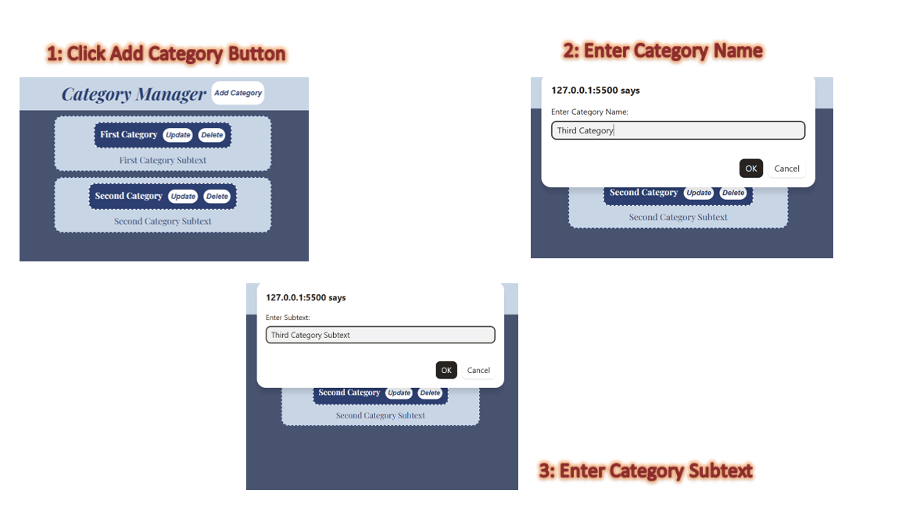
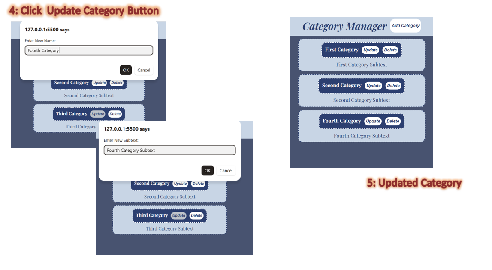
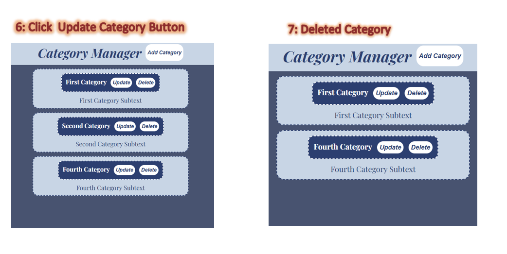

### Category Manager
#### A simple web app built to practice and understand how REST APIs work in a real project.

#### Category Manager is a lightweight CRUD application where users can add, view, update, and delete categories with a subtext/description. The UI is intentionally simple, the focus of this project is the API.

### What I Learned
#### As a developer, I believe having a solid understanding of APIs is one of the most important backend skills. This project helped me understand:
#### - How GET, POST, PUT, and DELETE work in a real API
#### - How the frontend communicates with the backend using fetch()
#### - How FastAPI handles routes and parameters
#### - What CORS is and why it matters when connecting frontend and backend

### Tech Stack
#### - Backend >> Python, FastAPI
#### - Frontend >> HTML, CSS, Vanilla Javascript

#### A walkthrough of the core CRUD operations: adding, updating, and deleting categories:

